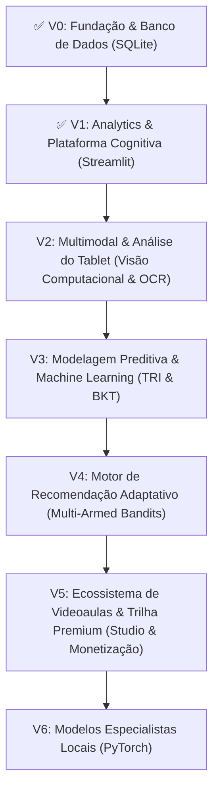

# 🗺️ MathAI — Master Roadmap & Arquitetura Evolutiva

> **"A IA aprende como você aprende Matemática para ajudar você a aprender melhor."**

---

## 📌 Visão Geral & Filosofia

O **MathAI** é uma plataforma inteligente de aprendizagem matemática projetada para criar um **perfil cognitivo individual e evolutivo** de cada estudante. 

Diferente de sistemas tradicionais que apenas corrigem gabaritos de forma mecânica, o MathAI investiga:
1. **O que o aluno sabe e o que evita;**
2. **Quais estratégias cognitivas utiliza** (ex: Teorema de Tales vs. Retas Paralelas; Relações de Girard vs. Briot-Ruffini; Menelaus vs. Semelhança);
3. **Padrões de erro recorrentes** (conta/sinal, manipulação algébrica, erro conceitual, interpretação);
4. **Justificativa do raciocínio e rascunho manuscrito** (análise lado a lado do que o aluno pensou e escreveu);
5. **Equilíbrio pedagógico:** $\text{Exploitation}$ (consolidar o que sabe via repetição espaçada SM-2) vs. $\text{Exploration}$ (desafiar hábitos e expandir repertório).

---

## 🏗️ Ciclo de Vida e Fases do Projeto



---

### 🧱 Fase 0: Fundação de Dados (V0 — O Cofre) — [CONCLUÍDA ✅]
* **Objetivo:** Estabelecer a persistência relacional com integridade, velocidade e constraints via **SQL (SQLite)**.
* **Entregáveis Concluídos:**
  - `data/mathai.db`: Banco de dados relacional com `PRAGMA foreign_keys = ON;`.
  - Tabela `questoes`: Enunciados com suporte a $\LaTeX$ (KaTeX), figuras vetoriais (SVG), matéria, tópico, nível de dificuldade e estratégias catalogadas.
  - Tabela `tentativas`: Histórico de resolução com cronômetro em segundos, acerto/erro, estratégia utilizada, tipo de erro, confiança (1 a 5), anotações/justificativa e caminho da imagem da resolução manuscrita.
  - Tabela `revisao_espacada`: Algoritmo **SuperMemo-2 (SM-2)** integrado para agendamento de revisões espaçadas.
  - Tabela `perfil_aluno_topico`: Agregação analítica em tempo real de tentativas, acertos e tempo médio por assunto.
  - Inserção das 12 questões da prova oficial da **ESA 2026 (Tipo A)** com gráficos vetoriais nativos em SVG.
  - `notebooks/gerenciador_questoes.ipynb`: Caderno interativo para visualização, inserção e administração do acervo.

---

### 📊 Fase 1: Interface, Resolução & Perfil Cognitivo (V1) — [CONCLUÍDA ✅]
* **Objetivo:** Interface moderna, responsiva e dinâmica em **Streamlit** para treinamento diário e diagnóstico de raciocínio.
* **Entregáveis Concluídos:**
  - **Treinador de Questões (`resolver.py`):**
    - Enunciados justificados com renderização matemática de alta precisão ($\LaTeX$).
    - Renderizador SVG vetorial via Data URI Base64 (sem quebra de tags de texto ou perda de nitidez).
    - **Alternativas Clicáveis Diretas:** Botões de largura total para marcar a opção sem necessidade de cliques em rodapé.
    - **Metacognição Lado a Lado:** Campo de justificativa do raciocínio em texto e upload de foto do caderno/print do tablet.
    - Cronômetro automático em segundo plano.
    - Feedback visual colorido imediato (verde para gabarito oficial e vermelho para a resposta do aluno).
  - **Dashboard do Estudante (`dashboard.py`):**
    - KPIs principais: Total Resolvidas, Taxa de Acerto (%), Tempo Médio e Acertos/Total.
    - Gráfico Adaptativo de Domínio (Radar para $\ge 3$ matérias e Barras para $< 3$).
    - Gráfico de Barras para frequência do repertório de estratégias.
    - Gráfico de Rosca para diagnóstico de causas de erro.
    - Painel de Próximas Revisões agendadas pelo algoritmo SM-2.
    - Histórico detalhado de resoluções com galeria expansível de rascunhos anexados.
  - **Banco de Questões (`banco.py`):**
    - Explorador completo com filtros dinâmicos por matéria, banca, ano e busca textual.
    - Botão direto para carregar qualquer questão no Treinador.

---

### 👁️ Fase 2: Multimodal & Análise do Tablet (V2 — Computer Vision) — [PRÓXIMO PASSO 🚀]
* **Objetivo:** Pipeline de visão computacional e IA multimodal para analisar as resoluções manuscritas já enviadas pelo aluno no campo de upload.
* **Entregáveis:**
  - OCR especializado em matemática manuscrita e símbolos ($\int, \sum, \Delta, \sqrt{x}$).
  - Reconhecimento dos passos da resolução:
    - Identificação exata da linha em que a álgebra ou o sinal quebrou;
    - Detecção automática de qual teorema geométrico foi desenhado no tablet/papel;
    - Geração de dicas socráticas progressivas (Nível 1 a 5) para guiar o aluno sem dar a resposta pronta.

---

### 🤖 Fase 3: Machine Learning & Modelagem Cognitiva (V3 — Model)
* **Objetivo:** Modelar probabilisticamente a proficiência do estudante e calibrar a dificuldade intrínseca de cada questão.
* **Entregáveis:**
  - **Teoria de Resposta ao Item (TRI):** Calibração do parâmetro de dificuldade $b$ e discriminação $a$ das questões.
  - **Bayesian Knowledge Tracing (BKT):** Estimativa contínua da probabilidade de domínio de cada tópico matemático pelo aluno:
    $$P(L_{t+1}) = P(L_t \mid \text{ação}) + (1 - P(L_t \mid \text{ação})) \cdot P(T)$$
  - Detector de vícios cognitivos (ex: insistência em equações longas quando há solução geométrica de 1 linha).

---

### 🎯 Fase 4: Motor de Recomendação Adaptativo (V4 — Recommender)
* **Objetivo:** Selecionar ativamente o "próximo melhor exercício" balanceando conforto e desafio através de algoritmos de exploração.
* **Entregáveis:**
  - Algoritmo de recomendação (*Contextual Multi-Armed Bandits*):
    $$\text{Score}(q) = \alpha \cdot P(\text{acerto}) + \beta \cdot V(\text{pedagógico}) + \gamma \cdot N(\text{novidade})$$
  - Modo *"Expandir Repertório"*: Desafios que bloqueiam a estratégia padrão para forçar o desenvolvimento de novas habilidades matemáticas (ex: *"resolva sem montar sistema linear"*).

---

### 🎬 Fase 5: Ecossistema de Videoaulas & Trilha Premium (V5 — Studio & Monetização)
* **Objetivo:** Integrar aulas autorais gravadas pelo Guilherme no estúdio próprio, transformando a plataforma em um ecossistema educacional completo e monetizável (*Freemium*).
* **Entregáveis:**
  - **Modelo Freemium:**
    - **Plano Gratuito:** Banco de questões, cronômetro, resolução interativa, repetição espaçada SM-2 e diagnóstico de erros.
    - **Plano Premium (Assinatura):** Acesso completo às videoaulas teóricas e práticas gravadas no estúdio, resoluções comentadas em tablet e trilhas de aprofundamento.
  - **Recomendação Inteligente de Aulas:**
    - A IA cruza a fraqueza detectada no aluno com a videoaula específica gravada para sanar aquela dúvida.
  - **Player de Vídeo Integrado:**
    - Player responsivo dentro da tela da questão (exibindo a resolução comentada pelo professor após a tentativa).
  - Tabela `aulas` no SQLite: Metadados das aulas (matéria, tópico, URL do vídeo, descrição, duração e flag `is_premium`).

---

### 🧠 Fase 6: Dataset Proprietário & Deep Learning Especialista (V6 — PyTorch)
* **Objetivo:** Treinar modelos próprios especializados com os dados reais acumulados ao longo das interações.
* **Entregáveis:**
  - Dataset proprietário de resoluções de estudantes com anotações de erros e estratégias.
  - Rede neural treinada em **PyTorch** especializada em diagramas e notação matemática em língua portuguesa.
  - Inferência local de alto desempenho com baixa latência.

---

## 🗂️ Estrutura Atual do Projeto

```
MathAI/
├── ROADMAP.md                      # Planejamento estratégico e evolução
├── README.md                       # Documentação geral do projeto
├── mockup.html                     # Protótipo conceitual interativo
├── app.py                          # Aplicação principal Streamlit (Porta 8501)
├── data/
│   ├── mathai.db                   # Banco de dados SQLite relacional
│   └── uploads/
│       ├── esa_2026_q02.svg        # Vetor SVG: Função logarítmica e trapézio
│       ├── esa_2026_q06.svg        # Vetor SVG: Gráfico de colunas (estatística)
│       ├── esa_2026_q09.svg        # Vetor SVG: Triângulo topográfico
│       ├── esa_2026_q10.svg        # Vetor SVG: Prisma retangular 3D
│       └── resolucoes/             # Rascunhos e fotos de resoluções dos alunos
├── notebooks/
│   └── gerenciador_questoes.ipynb  # Notebook para gestão e renderização de questões
└── src/
    ├── app/
    │   ├── utils.py                # Utilitários de parsing de enunciados e alternativas
    │   ├── components/
    │   │   ├── question_view.py    # Renderizador de LaTeX KaTeX e SVG nativo
    │   │   └── feedback_form.py    # Alternativas clicáveis, justificativa e metacognição
    │   └── pages/
    │       ├── resolver.py         # Treinador interativo com navegação sincronizada
    │       ├── dashboard.py        # Analytics do estudante, radar e galeria de rascunhos
    │       └── banco.py            # Explorador do acervo com filtros dinâmicos
    └── database/
        ├── __init__.py             # Pacote Python
        ├── schema.sql              # Schema relacional (questões, tentativas, SM-2, perfil)
        ├── db.py                   # Conexão SQLite e CRUD
        └── attempts.py             # Registro de tentativas, cálculo de métricas e SM-2
```
