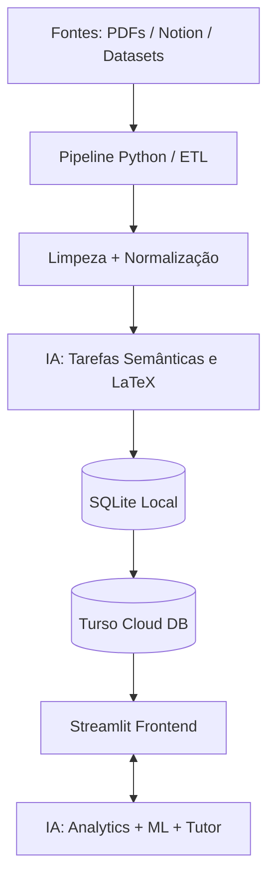

# Arquitetura do Sistema

O MathAI foi projetado para ser um sistema modular, separando responsabilidades entre ingestão pesada de dados, interface do usuário, armazenamento na nuvem e motores de IA.

## 🏗️ Arquitetura Geral

Uma decisão central do projeto foi **separar tarefas determinísticas de tarefas interpretativas**:
- Tudo o que pode ser extraído, limpo e estruturado por algoritmos convencionais (Regex, parsing de PDF, limpeza de texto) é feito localmente pelo Python.
- A Inteligência Artificial (Gemini) entra apenas onde há necessidade semântica (reconstruir fórmulas quebradas em LaTeX, diagnosticar passos de resolução ou traduzir).

### Fluxo Macro

## 🧩 Responsabilidades das Camadas

1. **Camada de Ingestão e Processamento (Offline-First)**
   - Scripts dedicados (`ingest_efomm.py`, `parser_efomm.py`, `ingest_notion_cederj.py`).
   - Carregam documentos brutos, aplicam expressões regulares, mantêm contexto de paginação e interagem com a API da IA em lotes para correção de OCR.
2. **Camada de Dados (Banco de Dados)**
   - Um arquivo SQLite local serve como *staging area* (ambiente de homologação e processamento).
   - O banco relacional na nuvem (Turso/LibSQL) hospeda os dados de produção para uso contínuo pela aplicação.
3. **Camada de Interface (Frontend Streamlit)**
   - Responsável pela renderização de equações via KaTeX.
   - Apresenta as questões aos usuários de forma fluida.
   - Filtros de navegação por bancas, anos e tópicos.
4. **Camada de IA e Analytics**
   - Interage em tempo real com as respostas do estudante.
   - Extrai transcrições, estratégias e gera *dicas socráticas*.

## 💾 Modelo de Dados e Separação Epistemológica

Um dos pilares do MathAI é a distinção clara na arquitetura entre dados baseados em evidência e dados baseados na interpretação probabilística do modelo de linguagem. 

**Dados Observados × Dados Derivados**
* O sistema diferencia os dados realmente observados dos dados interpretados pela IA.
* **Observados:** resolução bruta, resposta submetida, tempo de prova, acerto/erro lógico (match de gabarito), justificativa em texto, clique no botão de dica.
* **Derivados:** classificação do tipo de erro, taxonomia da estratégia matemática utilizada, diagnóstico pedagógico detalhado.

Isso previne que *alucinações* do modelo LLM envenenem as estatísticas consolidadas e permite que futuramente os dados observados originais sejam usados para treinar modelos preditivos (*Knowledge Tracing*) com evidência imutável.

## 🔄 Fluxo de Tentativas e Análise

Quando o aluno resolve uma questão, o fluxo desenrola-se da seguinte maneira:

1. **Ação do Aluno:** O estudante marca a alternativa ou digita a resposta e (opcionalmente) escreve como raciocinou.
2. **Coleta de Evidência:** A aplicação imediatamente salva a **Tentativa** no banco de dados (guardando o que é factual: tempo, resposta submetida).
3. **Análise por IA:** O prompt em conjunto com a resposta é despachado para a API multimodal. A IA tenta identificar as etapas e a estratégia.
4. **Classificação e Diagnóstico:** A IA devolve um JSON com o *tipo do erro* (ex: erro de sinal, erro conceitual) e uma orientação.
5. **Persistência Derivada:** Esse diagnóstico é atrelado à tentativa original na tabela `diagnosticos_ia`.

Esse ciclo contínuo alimenta o perfil matemático e o perfil de aprendizagem, criando a base para os sistemas de repetição espaçada e futura recomendação adaptativa.
