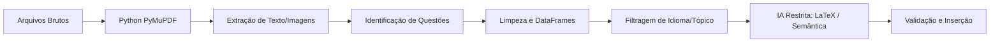

# Pipeline de Dados

A extração de questões matemáticas e científicas de documentos (especialmente PDFs) é notoriamente complexa devido a formatos, leiautes, numeração e ao uso intenso de símbolos que o OCR comum distorce. Para contornar isso, o MathAI utiliza um pipeline robusto, escalonado e focado na redução de dependências excessivas (e caras) de IA.

## 📚 Fontes de Dados

O banco de questões integra ativamente múltiplas fontes com naturezas diferentes:
- **Vestibulares Militares e Tradicionais (PDF):** EFOMM, ESA, ENEM (planejado).
- **Anotações Pessoais (Markdown):** Exportações do Notion (material do CEDERJ).
- **Repositórios Externos:** MathNet e outras bases massivas.

## ⚙️ A Filosofia Offline-First

A principal premissa deste pipeline é: *O que pode ser resolvido com código e matemática, não deve ser resolvido com IA*. O processamento foi estritamente faturado em etapas.

### 1. Ingestão e Processamento Local
A ingestão lê as pastas e quebra os PDFs por página. Com bibliotecas de extração em Python (como `PyMuPDF`), extraímos a camada de texto nativa do documento. As **imagens e diagramas** (extremamente importantes em questões de geometria) são salvos de forma referenciada e o seu contexto/página é preservado. 

### 2. Identificação, Limpeza e Normalização
Através de heurísticas (como sequenciamento matemático e detecção de quebras de prova) e Expressões Regulares avançadas (Regex), o texto contínuo é fatiado nas suas respectivas questões. Os dados costumam ser convertidos e organizados em **DataFrames**, permitindo normalização em lote, limpeza de rodapés, remoção de caracteres invisíveis e padronização das bancas (ex: "CEDERJ" em vez de nulo).

### 3. Identificação de Idioma e Tradução
Algumas bases contêm exames de múltiplos idiomas (inglês, português, espanhol). Quando necessário, o idioma é identificado no pipeline, acionando rotinas de filtragem (caso apenas material nacional seja desejado) ou roteamentos de tradução estruturada antes da injeção no banco de dados.

### 4. Tratamento de LaTeX via IA
Após isolar os textos de cada questão, é comum que fórmulas apareçam assimétricas (ex: OCR lendo `x=Srr/12`). É somente nesta etapa que a Inteligência Artificial é invocada. Em lotes curtos, blocos específicos do texto são remetidos à API (ex: Gemini Flash-Lite) com um prompt estrito: **converter matemática quebrada para notação LaTeX (`$$ ... $$`) preservando pontuação e gramática.**

### 5. Validação e Importação
O JSON gerado pela IA é sanitizado e inserido juntamente com as extrações offline no esquema relacional da aplicação. Esse passo também cuida para que incompatibilidades estruturais sejam neutralizadas (ex: mesclar um vetor de alternativas `A, B, C, D, E` ao final da string do `enunciado` caso a tabela não comporte colunas esparsas para opções).

## 💰 Custos de API e Controle
Essa abordagem garantiu processamento altamente reproduzível (com salvamento de logs em `data/extraidas/`) e **mitigou drasticamente os custos da API**. Usar a IA puramente como "formatadora cirúrgica" sobre trechos problemáticos revelou ser infinitamente mais rápido, barato e imune a alucinações (inventar questões) do que inserir o arquivo completo na janela de contexto do LLM.
